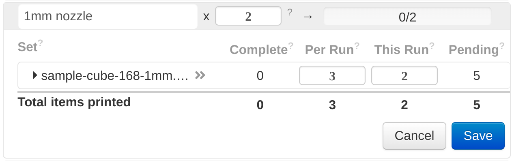

# Queuing Basics

In the [quickstart](/getting-started/) we covered the basics of adding prints to the queue and running them, but you can do much more once you understand the nested structure of the print queue.

## Sets and Jobs

The queue is actually made up of two levels: sets and jobs.

**Sets** are a single print file, printed one or more times. You created a set by following the "Add prints to the queue" step in the [quickstart](/getting-started/).

**Jobs** are a collection of sets, printed one or more times. Jobs are always printed sequentially, from the top of the queue to the bottom.

## Editing Jobs

Bring your cursor over a job in the queue, and click the pencil-and-paper icon that appears to begin editing a job.

You should see an interface like this:

Don't worry if it looks a bit daunting - we'll go over what each number means.

**The `x 2` number at the top** tells the queue to print this job two additional times. This is changed from earlier CPQ behavior, where it was a "total count". If your job completes and you want to print it one more time, just change this value from 0 to 1. Simple!

**The `complete` column** shows how many times the Set was printed for this run of the job. It resets to 0 when the job moves on to the next run.

**The `Per Run` column** is where you indicate the number of times each Set prints per run of the job.

**The `This Run` column** lets you add one-off prints of a Set without having to adjust the `Per Run` value. This can be handy when re-running some failed prints not caught by automation, for example. This number decrements down to 0 as prints complete, then "refills" back to the `Per Run` value when the job moves to the next run.

**The `Pending` column** computes the total number of expected future prints of a Set across all runs of the Job. Use this column to check that the other values are properly configured.

**The `Total Items Printed` row at the bottom** sums up all the values described above to give a total at the job level.

!!! Tip

    When you start editing a job, CPQ stops considering it for printing. You can edit a job that's currently printing with no problems, but if the print completes while the job is still in "edit mode" then the queue will move on to the next printable job.

## "Add" behavior

By default, every print file you add (as a Set) is appended to the earliest job being edited. If you want it to be part of a new Job, click the `+ New Job` button, then drag the set into the empty Job that appears.

## Example 1: Batched strategy

Let's consider an empty queue. If you create a job, then add `A.gcode` with `Per Run = 5` and `B.gcode` with `Per Run = 5`, the print order will be:

`AAAAA BBBBB`

This is great if you want all of your `A` files to print before all your `B` files, for instance when you're working on a project that uses `A` but plan use `B` for something later.

## Example 2: Interleaved strategy

Let's start again with an empty queue, but now suppose we add `A.gcode` with `Per Run = 1`, `B.gcode` with `Per Run = 1`, and then set the job count to `x 5`. The print order will now be:

`AB AB AB AB AB`

This is exactly the pattern you would want if you were, for example, printing a box with `A.gcode` as the base and `B.gcode` as the lid. Each box would be completed in order, so you can use the first box without waiting for all the bases to print, then for the first lid to print.

## Example 3: Combined strategy

From an empty queue, you could even add `A.gcode` with `Per Run = 1` and `B.gcode` with `Per Run = 4`, and set the job count to `x 3`. The outcome is then:

`ABBBB ABBBB ABBBB`

We're simply mixing examples 1 and 2 together, but this would be ideal for a base print with multiple smaller additions - a table with four legs, for instance.

## Drag and drop reordering

At any time, you can click and drag jobs and sets with the grips on the left (the two vertical lines):

* Dragging a job reorders it among the jobs in the queue.
* Dragging a set reorders it within a job.

!!! tip

    You can also drag a set from one job to another if they are both being edited! However, this can change the total number of that file printed if the destination job has a different count than the origin job.
