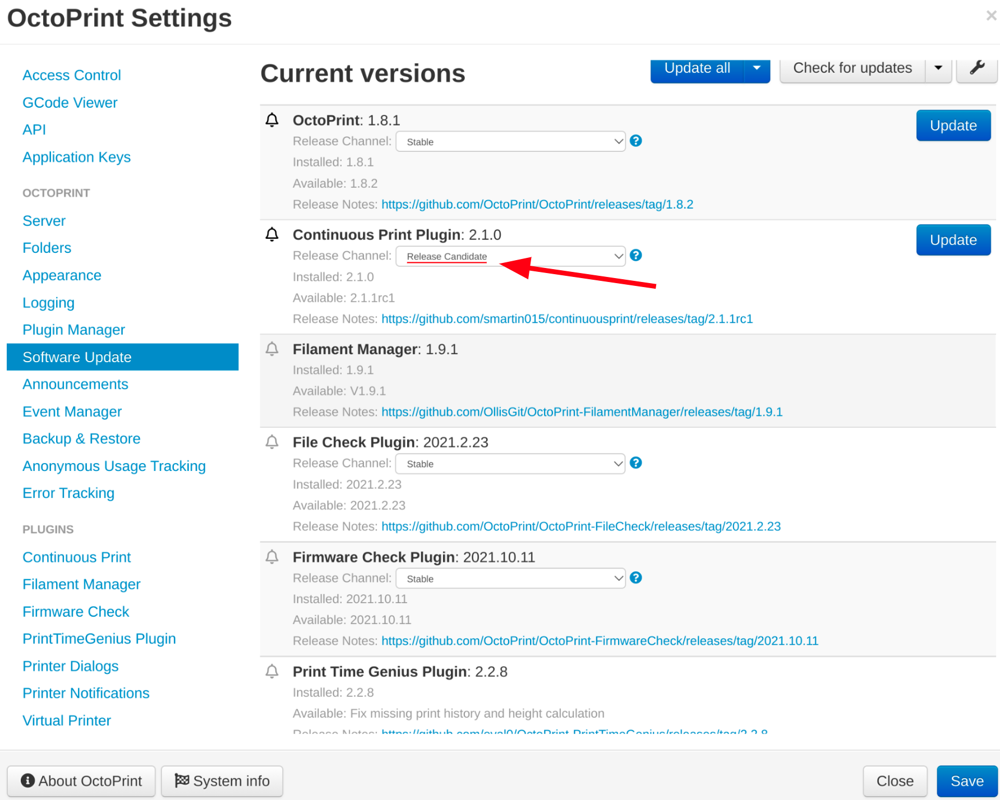

  </img>
  <h2>Continuous Print Queue</h2>

  

  </img>
  </img>
  

  
For an overview, check out the <a href="https://plugins.octoprint.org/plugins/continuousprint/">plugin repository page</a>.

  
If you're looking for source code, head over to the <a href="github.com/smartin015/continuousprint">github repository</a>.

  
Use the nav section on the left to learn more.

  
<a href="https://www.youtube.com/watch?v=zBh6Esd-XXQ" target="blank">
  </img>
  </a>

!!! tip "Get new features faster and help support the plugin!"

    CPQ is looking for early release testers!

    **Enable `Release Candidate` in your Software Update settings** to
    test releases early.

    When you discover bugs or think of improvements [create issues](https://github.com/smartin015/continuousprint/issues)
    so we can make the plugin reliable and feature-full.

    
